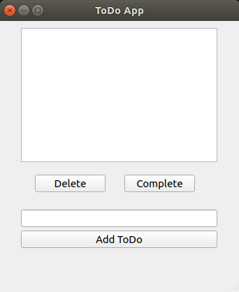
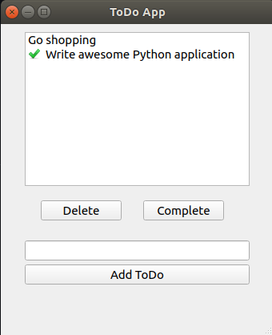

# ToDo Application

This is my ToDo application of simple web browser, based on [PyQt5 Tutorial](https://www.pythonguis.com/tutorials/modelview-architecture/)

## Features

It is a simple todo task application. It allows to:
* add new tasks
* delete existing tags
* mark task as completed.

List of tasks is stored in JSON file, it is reloaded after application startup and its state is refreshed after each update.

## Requirements

To this application you need to meet following requirements:

* Python > 3.6
* PyQt5 installed

## Other licenses:

Icons used in the application are by [Yusuke Kamiyaman](http://p.yusukekamiyamane.com/).